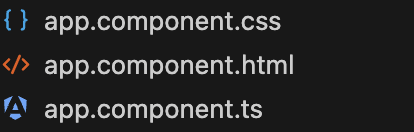
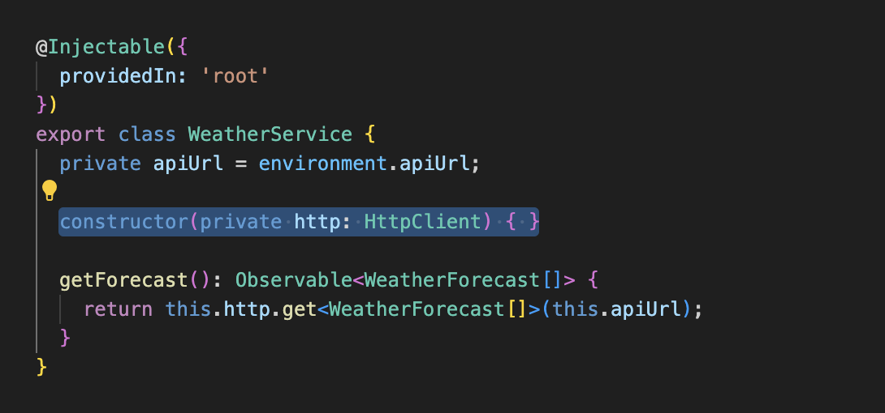
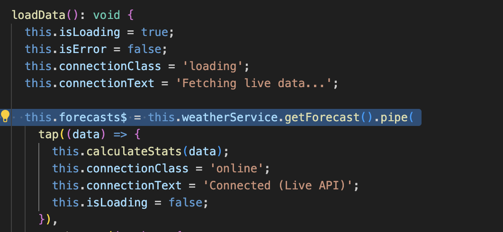
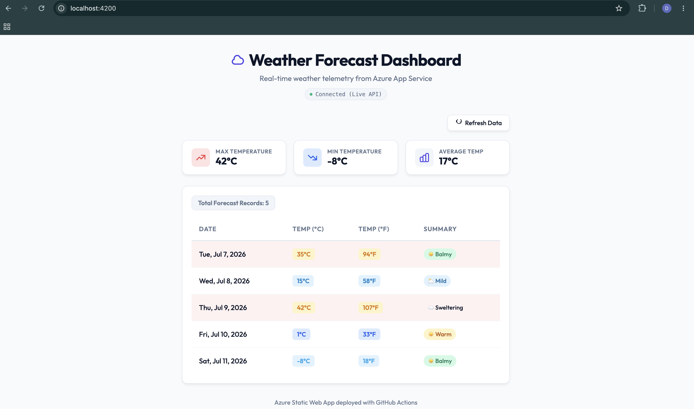
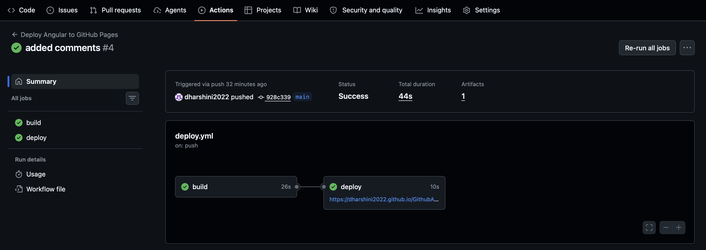
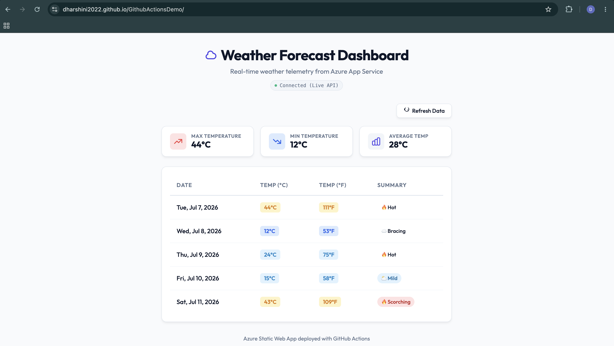

# Weather Forecast Dashboard (Angular App)

This project has been restructured as an Angular standalone application that connects to the Azure App Service Weatherforecast API and presents live telemetry metrics and dynamic table visualization with a clean light theme.

## Project Structure

```
weather-app/
├── src/                  # Application source code
│   ├── app/              # Standard standalone AppComponent
│   ├── index.html        # Main HTML layout
│   ├── main.ts           # Boostrapper
│   └── styles.css        # Premium Light-themed CSS style sheets
├── public/               # Public assets / images
├── environments/         # Configuration environment variables
│   ├── environment.ts    # Development endpoint
│   └── environment.prod.ts # Production deployment endpoint
├── .github/              # Automation workflow files
│   └── workflows/
│       └── deploy.yml    # CI/CD deployment configuration
├── angular.json          # Angular CLI workspace parameters
├── package.json          # Module dependencies
└── README.md             # Project handbook
```

## Running the App Locally (smoke test)

1. Install dependencies:
   ```bash
   npm install
   ```

2. Run the development server:
   ```bash
   npm start
   ```

3. Open `http://localhost:4200` to view the running dashboard.

## Production Build

To build the static bundle for Azure deployment:
```bash
npm run build
```
The optimized HTML/JS/CSS assets will compile to the `dist/weather-app/browser/` directory, ready to be served.

## WorkFlow
```text
                           Developer
                               │
                     Develop Angular Application
                               │
                               ▼
                     Commit Local Changes
                               │
                     git add . && git commit
                               │
                               ▼
                      git push origin main
                               │
                               ▼
                    GitHub Repository (main)
                               │
             Push event triggers GitHub Actions
                               │
                               ▼
                  GitHub Actions CI/CD Pipeline
                               │
     ┌─────────────────────────────────────────────────┐
     │                 Build Stage                     │
     ├─────────────────────────────────────────────────┤
     │ ✓ Checkout Repository                           │
     │ ✓ Setup Node.js Runtime                         │
     │ ✓ Restore npm Cache                             │
     │ ✓ Install Dependencies (npm ci)                 │
     │ ✓ Run Lint Checks                               │
     │ ✓ Run Unit Tests (optional)                     │
     │ ✓ Build Angular (Production)                    │
     │ ✓ Generate Static Assets (dist/)                │
     │ ✓ Upload Build Artifact                         │
     └─────────────────────────────────────────────────┘
                               │
                               ▼
                  GitHub Pages Deployment Stage
                               │
                     Deploy Uploaded Artifact
                               │
                               ▼
                 GitHub Pages Static Website
      https://<github-username>.github.io/<repository-name>/
                               │
                               ▼
                     User Opens Website
                               │
                               ▼
                   Angular Application Loads
                               │
                               ▼
               HTTP GET /WeatherForecast (HTTPS)
                               │
                               ▼
        Azure App Service (.NET Web API Backend)
https://sampleapi20260706g3-bvdacte9b0dvhudv.canadacentral-01.azurewebsites.net
                               │
                               ▼
                     Returns JSON Response
                               │
                               ▼
                Angular Parses Response
                               │
                               ▼
               Weather Data Rendered in UI
```
# Submission Documentation: Weather Forecast Dashboard

This document details the implementation of the core features, architectural patterns, optional bonus tasks, and the automated CI/CD pipeline configuration for the Weather Forecast Dashboard.

---

## 1. Expected Skills Demonstrated

### Angular Components
- **Implementation**: The dashboard is controlled by a single-page standalone component (`AppComponent` inside `src/app/app.component.ts`).
- **Functionality**:
  - Encapsulates component states (loading, errors, error messages, connection text, and CSS status classes).
  - Handles client-side formatting, including translating backend ISO date strings to human-readable locale formats (`formatDate`).
  - Implements helper utility functions to dynamically match temperature values with CSS color tokens (`getTempClass`) and map text summaries to appropriate weather emojis (`getSummaryIcon`).
  

### Angular Services
- **Implementation**: Data fetching logic is separated from the view layer and placed inside the `WeatherService` (`src/app/services/weather.service.ts`).
- **Functionality**:
  - Registered globally using `@Injectable({ providedIn: 'root' })`.
  - Exposes `getForecast()` which queries the Azure App Service backend.


### HttpClient
- **Implementation**: Angular's `HttpClient` is imported and injected into `WeatherService` via dependency injection in the constructor:
  ```typescript
  constructor(private http: HttpClient) { }
  ```
  
- **Functionality**:
  - Leverages strongly typed requests to return TypeScript objects matching the `WeatherForecast` model interface:
    ```typescript
    getForecast(): Observable<WeatherForecast[]> {
      return this.http.get<WeatherForecast[]>(this.apiUrl);
    }
    ```

### Observables
- **Implementation**: Converted the component lifecycle from manual subscriptions to a fully reactive data flow using RxJS Observables.
- **Functionality**:
  - Declared `forecasts$: Observable<WeatherForecast[]> | null = null` in the component.
  - Used RxJS `pipe()` with the `tap` operator to execute side-effects (calculating high/low/avg statistics, resetting loading/connection states) upon successful emission.
  - Handled errors reactively using the `catchError` operator to display error blocks gracefully and return safe fallback values (`of([])`).
  - Utilized Angular's `async` pipe in the HTML template (`forecasts$ | async`) to automatically handle subscribing and unsubscribing, preventing memory leaks.
  

### Git & GitHub
- **Implementation**: Version controlled using Git with a remote repository hosted on GitHub.
- **Functionality**: Version logs record granular code commits, sync to branch `main`, and trigger GitHub workflows.

### GitHub Actions
- **Implementation**: Created an automated build-and-deploy pipeline using GitHub Actions workflow (`.github/workflows/deploy.yml`).
- **Functionality**:
  - Triggered automatically on push events to `main`.
  - Runs parallelized checkout, dependencies installation, caching, compiling, and deployment actions.

### GitHub Pages Deployment
- **Implementation**: Configured GitHub Pages deployment as the continuous deployment (CD) phase of the GitHub Actions workflow.
- **Functionality**:
  - Automatically compiles the application using the Repository name as the base-href (`--base-href "/${{ github.event.repository.name }}/"`).
  - Uploads compiled production static assets using `actions/upload-pages-artifact@v3`.
  - Deploys the static files using `actions/deploy-pages@v4`.

### Basic Responsive UI Design
- **Implementation**: Defined responsive rules in `src/styles.css` using a mobile-first philosophy, standard flexboxes, dynamic CSS Grid layouts, and CSS variable color tokens.
- **Functionality**:
  - Adaptable Grid (`grid-template-columns: repeat(auto-fit, minmax(200px, 1fr))`) for statistics telemetry cards.
  - Media queries (`@media (max-width: 768px)`) adjust headings size, pad containers, stack control buttons, and expand table cards for maximum accessibility on mobile devices.

### CI/CD Fundamentals
- **Implementation**: Automated checks ensure quality gates before publication.
- **Functionality**:
  - **CI Job (`build`)**: Compiles Angular code inside a temporary runner. If TypeScript compilation fails, the pipeline halts immediately.
  - **CD Job (`deploy`)**: Only runs if the compilation succeeds. It automatically publishes the verified build artifact, ensuring zero-downtime updates.

---

## 2. Bonus Tasks Implementation

### Bonus 1: Display Weather Forecast Count
- **Implementation**: The total number of loaded forecast items is displayed in the template inside a custom container utilizing the local variable mapped by the `async` pipe:
  ```html
  <div class="table-responsive" *ngIf="!isError && (forecasts$ | async) as forecasts">
    <div class="forecast-count">
      Total Forecast Records: {{ forecasts.length }}
    </div>
    ...
  ```
  - **Aesthetics**: Displayed inside a styled, pill-like badge background to seamlessly match the UI design system.

### Bonus 2: Conditional Highlighting for Temperature > 30°C
- **Implementation**: Highlighted rows matching the criteria using Angular's class binding `[class.highlight-hot]` on `<tr>` elements:
  ```html
  <tr *ngFor="let forecast of forecasts" [class.highlight-hot]="forecast.temperatureC > 30">
  ```
  - **Styling**: Configured a pastel rose background (`#fff1f2`) in `src/styles.css` with matching hover state transitions (`#ffe4e6`) to make high-temperature data stand out beautifully without disrupting the dashboard theme.

### Bonus 3: Refresh Button
- **Implementation**: The dashboard features an interactive "Refresh Data" button that executes `loadData()` on click.
  - **Reactivity**: Calling `loadData()` constructs a new observable stream and re-assigns `this.forecasts$`. The `async` pipe in the template detects this reference change, automatically unsubscribes from the previous request, and subscribes to the new request, triggering a hot reload of backend weather data.

---

## 3. Deliverables

### Links
- **GitHub Repository URL**: [https://github.com/dharshini2022/GithubActionsDemo](https://github.com/dharshini2022/GithubActionsDemo)
- **GitHub Pages URL**: [https://dharshini2022.github.io/GithubActionsDemo/](https://dharshini2022.github.io/GithubActionsDemo/)

### Application Screenshots

#### Screenshot 1: Application Running Locally
*Refer to the local screenshot located in `screenshots/local-app.png` showing the dashboard, refresh status, and highlighted hot rows at `http://localhost:4200/`:*


#### Screenshot 2: GitHub Actions Successful Run
*Refer to the GitHub Action workflow execution run located in `screenshots/github-actions-run.png` showing completed Build and Deploy jobs:*


#### Screenshot 3: Application Running from GitHub Pages
*Refer to the production deployment screenshot located in `screenshots/production-app.png` displaying the live dashboard loaded directly from GitHub Pages pointing to the Azure API:*


